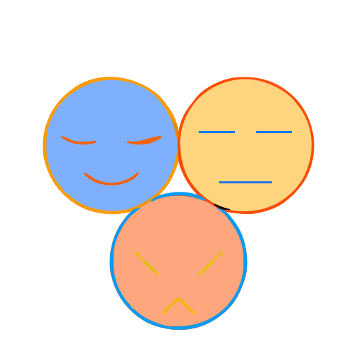

<p align="center">
  
</p>

<h1 align="center">Ubel Stratum</h1>

<p align="center"><strong>Multi-Tier Systems Language</strong></p>

[](LICENSE)
[]()
[](https://www.rust-lang.org/)
[]()

> **"The right memory model for every function."**

---

## ⚠️ Current Status: Early Development

**The end goal is native machine code via an LLVM backend.** Right now, Ubel Stratum
runs as a tree-walking interpreter — a deliberate stepping stone, not the final
architecture. Building the interpreter first proves out the language and its
semantics completely before taking on LLVM integration, which is a much heavier
lift than anything built so far (this project already dropped LALRPOP for exactly
this reason — see Phase 1 below). Source files use the `.ubl` extension.

**Development Roadmap:**
1. ✅ **Phase 1**: Core design, memory model, lexer (Logos), arena AST, parser
2. ✅ **Phase 2**: Semantic analysis — name resolution, type inference, tier enforcer
3. ✅ **Phase 3**: Tree-walking interpreter — **current execution model**
4. 📋 **Phase 4**: LLVM backend → native binary — **the real end goal, not yet started**
5. 📋 **Phase 5**: Standard library, tooling, package manager

Phase 1's parser is worth a specific note: LALRPOP was the original plan, but its
build-time codegen turned out too heavy for free GitHub Actions runners and for
local dev on older hardware. It's kept in the tree (`crates/parser`) as an inactive
reference implementation — not a default workspace member, not used by anything.
The real, live parser is a hand-written recursive-descent + Pratt parser
(`crates/rd_parser`) — see [`PARSER_RULES.md`](docs/PARSER_RULES.md) for the full
architecture writeup. The same hardware-constraint reasoning shows up throughout
this project: the LOW-tier borrow checker currently under construction is being
hand-written too, specifically to avoid pulling in a Datalog engine or an SMT
solver.

Phase 2 is substantial at this point, not just "started": full generics
(structs/enums), enum discriminants and payloads, the three-tier memory model with
real escape-boundary checking (arena/pool references can't leak out of their
scope), `Pool<T>`/`Handle<T>` with generational handles, `Linqerizer<T>` (a lazy,
HIGH-tier-only query pipeline — see below), and — very recently — the syntax and
structural-type layer for LOW-tier references (`&`/`ref`, `&mut`/`ref mut`,
`*`/`deref`) plus the first piece of the LOW-tier borrow checker itself (a
control-flow graph builder). The borrow checker's actual loan/liveness enforcement
isn't built yet; see [`MEMORY_MODEL.md`](docs/MEMORY_MODEL.md) §9 for exactly
where that stands.

---

## 🚀 What is Ubel Stratum?

Ubel Stratum is a systems programming language **designed** to compile to native
machine code via LLVM (Phase 4, still ahead). Its defining feature is a **tier
system** — every function declares which memory strategy it uses, and the
compiler enforces the rules statically:

| Tier | Annotation | Memory | Async | Use case |
|------|-----------|--------|-------|----------|
| HIGH | `@tier(high)` (default) | Garbage collected | ✅ | Business logic, I/O |
| MID | `@tier(mid)` | Arena allocated | ❌ | Parsers, hot paths |
| LOW | `@tier(low)` | Manual + borrow checker | ❌ | Systems, FFI, packets |

Functions without a `@tier` annotation default to **HIGH**. You opt *down* for
performance, not up for convenience.

### Why does this matter?

Every serious language makes one memory bet for the whole program:

| Language | Bet | Price |
|----------|-----|-------|
| Go / Java / C# | GC everywhere | Pauses, GC pressure, heap bloat |
| Rust | Ownership everywhere | Steep learning curve, slow compile |
| C / C++ | Manual everywhere | Safety bugs, UB |

Ubel lets each **function** make its own bet. GC where it's easy; arenas where it's
fast; manual ownership where it's critical. The compiler guarantees the bets never
clash at runtime.

---

## 🏗️ How the Final Product Will Work

**This section describes the Phase 4 target architecture — not what runs today.**
For what's actually working right now, see [Building](#️-building) below.

When Ubel eventually ships a native binary, it will contain:

- **Your code** compiled to machine instructions via LLVM
- **A small GC runtime** linked in for HIGH-tier allocations (similar to Go's runtime,
  but much smaller — it only manages HIGH-tier objects)
- **An arena allocator** for MID-tier (a bump-pointer; ~50 lines of code at the asm level)
- **Nothing extra** for LOW-tier — it compiles to the same raw code Rust or C would

The result should feel like Rust from the outside (fast startup, small binary, no
JVM) but with a built-in, opt-in GC for the parts of your code that need it.

### Target execution flow

```
source.ubl
    │
    ▼
Compiler pipeline
    │
    ├── Lexer (Logos)
    ├── Parser (RD + Pratt) → Arena AST         ← Phase 1, done
    ├── Name resolution                          ← Phase 2, done
    ├── Type checker                              ← Phase 2, done
    ├── Tier enforcer                              ← Phase 2, done (LOW-tier
    │                                                  borrow checking still WIP)
    │
    ├─┬─ Tree-walking interpreter ─── runs the AST directly    ← Phase 3, done,
    │ │                                                            current reality
    │ │
    │ └─ Lowering to LLVM IR ──────── future                   ← Phase 4, not started
    ▼
LLVM IR (future)
    │
    ▼
Native Binary (future)
    ├── HIGH-tier functions → calls into tiny GC runtime
    ├── MID-tier functions  → bump-allocates in local arenas
    └── LOW-tier functions  → raw machine code, zero overhead
```

---

## 🔗 Inter-Tier Communication

This is the hardest part of the language to get right. Here is the precise model —
these rules are enforced today, by the tier checker, regardless of whether code
runs through the interpreter or (eventually) compiles to native code.

### The Core Constraint

A MID-tier function allocates data in an arena. When that arena is freed, all pointers
into it become invalid. HIGH-tier code must never hold a live pointer into a freed arena.
The type system enforces this at **compile time** — no runtime check needed.

The mechanism: any value that lives in an arena `A` has a type parameterised by the
arena's lifetime `'a` (written `&'a T`). The compiler refuses to compile any program
where `&'a T` appears in a type that outlives arena `A`.

Three sanctioned patterns for crossing the MID→HIGH boundary — illustrative of the
*pattern*, not a claim that these exact function names ship in a stdlib yet:

---

### Pattern 1: Callback (single result)

The safest and most common pattern. MID parses into an arena, calls your HIGH closure
with a *borrow* into the arena, the closure produces a GC-owned `R`, then the arena
is freed. The closure's borrow is strictly contained inside the arena's lifetime.

```ubl
// MID tier: fast JSON parser
@tier(mid)
fn parse_json_with<F, R>(input: string, callback: F) R
    where F: fn(&JsonView) R   // R must contain no arena refs
{
    with arena(1MB) {
        let view = build_json_view(input)  // arena-allocated
        return callback(&view)             // borrow passed in; R copied out
    }
    // arena freed here — view is gone, but R (GC-owned) lives on
}

// HIGH tier: calls MID, gets back a clean GC value
@tier(high)
fn handle_request(req: Request) Response {
    parse_json_with(req.body, fn(json) {
        // json: &JsonView — borrow only valid inside this closure
        let user_id = json.get("user_id").as_int()
        return fetch_user(user_id)   // Response is GC-owned — safe to return
    })
}
```

The type system enforces that `R` (the return type) contains no `&'arena T`. If you
try to smuggle an arena reference out through `R`, the tier-checker rejects it.

---

### Pattern 2: Iterator (streaming results)

For processing large datasets without allocating the whole result at once.
MID drives the iteration internally; HIGH only ever sees GC-owned values one at a time.

```ubl
// MID tier: produces transformed items one at a time
@tier(mid)
fn transform_each<R>(items: &[Item], f: fn(&TransformedItem) R) List<R> {
    with arena(10MB) {
        let mut results = List.new()
        for item in items {
            let transformed = expensive_transform(item)  // arena-allocated
            results.push(f(&transformed))                // R is copied to GC heap
        }
        return results  // List<R> is GC-owned; no arena refs inside
    }
}
```

---

### Pattern 3: View (read-only borrow, syntactic sugar)

When you only need to *read* MID-tier data without extracting values,
the `view` pattern gives a scoped read-only window into the arena.
This is syntactic sugar over the callback pattern and follows identical rules.

```ubl
@tier(high)
fn parse_config(path: string) Config {
    let config_view = read_toml_view(path)  // MID tier call; view scoped here
    using let v = config_view {
        let host = v.get("host").to_owned()  // .to_owned() copies to GC heap
        let port = v.get("port").as_int()    // int is Copy — always safe
        return Config { host, port }
    }
    // view freed; only Config (GC) survives
}
```

---

### What is explicitly forbidden

The compiler will **reject** these patterns at compile time:

```ubl
// ❌ Storing an arena reference in a GC-managed struct
@tier(high)
struct BadCache {
    data: &JsonView   // Error: JsonView contains arena lifetime; can't live in HIGH struct
}

// ❌ HIGH tier constructing an arena directly
@tier(high)
fn bad() {
    with arena(1MB) { ... }   // Error: 'with arena' is only valid in MID tier
}

// ❌ Returning an arena ref from a cross-tier function
@tier(mid)
fn bad_leak(input: string) &JsonView {   // Error: return type contains arena lifetime
    with arena(1MB) {
        return &parse(input)  // compiler catches this
    }
}

// ❌ await inside MID tier
@tier(mid)
fn bad_async(input: string) string {
    let result = await some_future()   // Error: await is only valid in @tier(high)
    return result
}
```

### The full cross-tier call matrix

Not just "LOW can't call HIGH" — the enforced rule is a real matrix:

| Caller | Callee | Allowed? |
|--------|--------|----------|
| HIGH | MID | ✅ (callback/view patterns encouraged, not enforced) |
| HIGH | LOW | ✅ |
| MID | HIGH | ❌ — would risk an arena lifetime escaping |
| MID | LOW | ✅ |
| LOW | HIGH | ❌ |
| LOW | MID | ❌ |

```ubl
@tier(low)
fn write_packet(buf: &mut [u8]) usize {
    let x = some_high_fn()   // ❌ Error: @tier(low) cannot call @tier(high)
    let y = some_mid_fn()    // ❌ Error: @tier(low) cannot call @tier(mid) either
}
```

---

## 📋 Language Features

### Tier annotations

```ubl
// Default: HIGH — no annotation needed for most code
fn handle_request(req: Request) Response {
    let user = fetch_user(req.user_id)
    return Response.ok(user.to_json())
}

// Opt into MID for a hot path
@tier(mid)
fn parse_payload(body: string) ParsedData {
    with arena(1MB) { ... }
}

// Opt into LOW for systems code
@tier(low)
fn write_packet(buf: &mut [u8]) usize {
    // Raw ownership; borrow checker enforcement still WIP — see MEMORY_MODEL.md §9
}
```

### Collections (C#-style names)

```ubl
let mut numbers = List.new()
numbers.push(1)
numbers.push(2)

let mut scores = Dictionary<string, int>.new()
scores.set("Alice", 100)             // not `.insert()` — renamed for get/set symmetry

let items = [1, 2, 3, 4, 5]          // array literal
let names = ["Alice", "Bob"]          // inferred as List<string>
```

### Unified `.` access — no `::`

```ubl
summon std.collections.List
let list = List.new()        // type-level call
list.push(42)                // instance call
// it's always . — never ::
```

### Error handling

```ubl
// ! suffix means "may fail"
fn parse_int(s: string) int! {
    // ... returns Result
}

// ? propagates errors
fn process(s: string) int! {
    let n = parse_int(s)?   // propagates on failure
    return n * 2
}
```

### Async (HIGH tier only)

Async is only allowed in HIGH tier. MID and LOW are synchronous. This is a deliberate
constraint: arenas have lexical lifetimes, which are incompatible with the way async
suspends and resumes across await points.

```ubl
@tier(high)
async fn fetch_user(id: int) Task<User>! {
    let resp = await http_get($"/users/{id}")?
    return await parse_user(resp.body)?
}
```

### Structs and methods

```ubl
struct Rectangle {
    width: int,
    height: int

    pub fn new(w: int, h: int) Rectangle {
        return Rectangle { width = w, height = h }
    }

    pub fn area(self) int {
        return self.width * self.height
    }
}
```

### Pattern matching

```ubl
match response {
    Ok(data) where data.status == 200 => process_success(data),
    Ok(data) => log_warning($"Status: {data.status}"),
    Err(NetworkError(extract { code, message })) => {
        log_error($"Network error {code}: {message}")
    }
    Err(e) => log_error($"Unknown: {e}"),
}
```

### Pipe operator

```ubl
let result = data
    |> parse?
    |> validate?
    |> transform
    |> save
```

### Extension functions

```ubl
extend int {
    fn is_even(self) bool { return self % 2 == 0 }
}

if 42.is_even() { println("Even!") }
```

### References and lifetimes (LOW tier)

`&`/`ref` and `&mut`/`ref mut` are dual spellings of the same borrow operator —
`*`/`deref` likewise for dereference — same precedent as `and`/`&&`, `or`/`||`.
Pick whichever reads better for the moment; both compile to the identical AST node.
Named lifetimes are only needed for complex cross-function borrows; simple cases
are inferred.

```ubl
// Inferred — no annotation needed
fn first(list: &List<int>) &int {
    return &list[0]
}

// Same thing, keyword spelling
fn first(list: ref List<int>) ref int {
    return ref list[0]
}

// Complex case — explicit lifetime
fn longest[lifetime L](x: &L str, y: &L str) &L str {
    if x.len() > y.len() { return x } else { return y }
}
```

The syntax and structural typing for all of this is live today. What's still
ahead: the actual borrow *checker* — loan tracking, liveness, `outlives`
enforcement, move checking. A control-flow-graph builder (the first piece it needs)
exists now; nothing consumes it yet. See `docs/MEMORY_MODEL.md` §9 for the exact,
current line between "parses and type-checks" and "is actually verified safe."

### RAII with `using`

```ubl
using let file = File.open("data.txt") {
    let content = file.read()
    process(content)
}   // file.close() called automatically
```

### Query pipelines — `Linqerizer<T>` (HIGH tier only)

A lazy, chainable query pipeline over any collection — `.query()` snapshots the
source once; nothing runs until a terminal call (`.to_list()`, `.first()`,
`.count()`) walks the pipeline. Each chained call returns a new pipeline rather
than mutating in place.

```ubl
@tier(high)
fn active_adult_names(users: List<User>) List<string> {
    return users.query()
        .where(fn(u) u.age >= 18 and u.status == "active")
        .order_by(fn(u) u.name)
        .select(fn(u) u.name)
        .to_list()
}
```

`.group_by(...)` produces a real `Dictionary<Key, List<Value>>`. This replaced an
earlier query-comprehension grammar (`from x in ... where ... select ...`) that
was removed outright rather than kept alongside — see `docs/PARSER_RULES.md` §6
for why.

---

## 🛠️ Building

### Prerequisites

- Rust **1.75** specifically — this project targets free GitHub Actions runners
  and older local hardware, so the toolchain is pinned rather than "stable."
  A handful of dependencies need pinning to versions that still support 1.75:

  ```bash
  cargo update -p owo-colors  --precise 4.0.0
  cargo update -p backtrace   --precise 0.3.69
  cargo update -p proptest    --precise 1.4.0
  cargo update -p tempfile    --precise 3.14.0
  cargo update -p clap        --precise 4.4.18
  cargo update -p rayon       --precise 1.10.0
  cargo update -p rayon-core  --precise 1.12.1
  cargo update -p half        --precise 2.4.1
  ```
- LALRPOP is **not** required — it's an inactive reference crate, not a default
  workspace member. Ignore it unless you're specifically working on `crates/parser`.

### Build

```bash
cargo build --workspace --all-targets
cargo test  --workspace --lib --bins
cargo bench   # crates/core, crates/rd_parser, and crates/parser each have benches/
```

### Running the compiler pipeline

There's no standalone CLI binary yet (Phase 5). The way to exercise lex → parse →
sema → interpret today is the pipeline example in `crates/rd_parser`:

```bash
# Run the full pipeline against every fixture
cargo run -p ubel_stratum_rd --example pipeline -- tests/fixtures

# Against a single file
cargo run -p ubel_stratum_rd --example pipeline -- path/to/file.ubl
```

This is exactly what CI runs — see the **Pipeline Dashboard** GitHub Actions
workflow for the same output rendered as a Job Summary on every push.

---

## 🧪 Testing

Three layers, each catching different classes of bugs.

### Level 1 — Unit tests (inside source files)

`#[cfg(test)]` modules colocated with the code they test — `symbol_table.rs` tests
scope shadowing and duplicate detection, `type_table.rs` tests interning
correctness, `sema/cfg.rs` tests the LOW-tier control-flow-graph builder's
block/edge shapes directly against hand-built AST fragments. Run with:

```bash
cargo test --workspace --lib --bins
```

### Level 2 — Fixture sweep (`tests/fixtures/*.ubl`)

Real `.ubl` source files driven through the complete lex → parse → sema →
interpret pipeline. `ok_*.ubl` fixtures are expected to pass every stage;
`err_*.ubl` fixtures are expected to fail at a specific, named stage (check the
fixture's own header comment for which one). Run the same way described above in
[Building](#running-the-compiler-pipeline).

### Level 3 — CI Pipeline Dashboard

Every push runs the full fixture sweep and renders the results as a GitHub
Actions Job Summary — stage-by-stage pass/fail counts, and a table of every
failing fixture with the stage it failed at, so an `err_*` fixture's expected
failure is never confused with a real regression at a glance.

---

## License

MIT OR Apache-2.0
